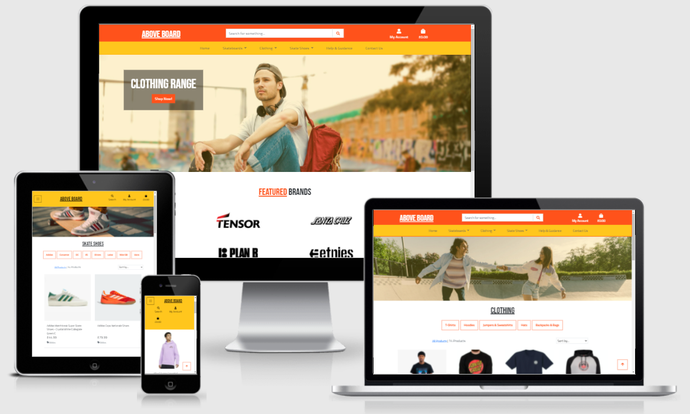

# Taylor Brookes - Milestone Project 4
## Above Board

[Visit my live website here!](https://aboveboard-ms4.herokuapp.com/)

# Table Of Contents

1. [Overview](#overview)
2. [UX](#ux)
    * [Five UX Planes](#five-ux-planes)
        * [Strategy](#strategy)
            * [Target Audience](#target-audience)
            * [Business Goals](#business-goals)
            * [User Stories](#user-stories)
        * [Scope](#scope)
        * [Structure](#structure)
        * [Skeleton](#skeleton)
            * [Wireframes](#wireframes)
        * [Surface](#surface)
            * [Colours](#colours)
            * [Typography](#typography)
            * [Imagery](#imagery)
3. [Features](#features)
    * [Current Features](#current-features)
    * [Future Features](#future-features)
4. [Technologies Used](#technologies-used)
    * [Languages](#languages)
    * [Frameworks](#frameworks)
5. [Testing](#testing)
6. [Deployment](#deployment)
7. [Credits](#credits)

# Overview

Above Board is an e-commerce site used for educational purposes, and I have focused on Skateboarding for the theme of my project. 

You’ll find the essential products you’d need to start or continue skating, from complete decks, trucks and wheels, to t-shirts, hats and skate shoes. The Help & Guidance section provides information on how to start skating, useful links and more!

[Back to Contents](#table-of-contents)

# UX
## Five UX Planes

### Strategy

#### Target Audience
The target audience of my site is people who are looking to purchase skateboards, skateboarding hardware or clothes. It is geared towards both current and new skaters, and including products for both of these types of customer. 

#### Business Goals
-	To provide an easily navigable e-commerce site
-	Connect with users via social media and through blog posts
-	Making a profit by selling products

#### User Stories
#### Common User Stories

#### First Time Users

#### Returning Users

#### Site Owner/Admin
-	Provide a clean, simple e-commerce store so that users can easily find what they’re looking for
-	Have the ability to add, edit/update and delete products
-	Have the ability to add, edit and delete blog posts
-	Keep the site secure by only allowing authorised users access certain areas of the site
-	Securely store user information in case an error occurs

### Scope

### Structure

### Skeleton

#### Wireframes

Home

Products

Product Detail

Checkout

Checkout Success/Order History

Sign Up

Sign In

Profile

Product Management

Help & Guidance

Help & Guidance Management

404/500 Pages

### Surface
#### Colours
#### Typography
#### Imagery

[Back to Contents](#table-of-contents)

# Features

## Current Features

## Future Features

[Back to Contents](#table-of-contents)

# Technologies Used

## Languages

## Frameworks

[Back to Contents](#table-of-contents)

# Testing

Find the full Testing Document [here!](TESTING.md)

[Back to Contents](#table-of-contents)

# Deployment

[Back to Contents](#table-of-contents)

# Credits

## Code

I followed the course walkthrough project "Boutique Ado" by Code Institute which helped massively in setting up my project. 

#### Hover on menu items

https://bootstrap-menu.com/detail-basic-hover.html

#### Django Pagination

https://www.youtube.com/watch?v=N-PB-HMFmdo

https://www.youtube.com/watch?v=wY_BNsxCEi4

#### Product Reviews

For the product reviews, I had a lot of help from student Harry Dhillon who I thank immensely. 

## Images

### Favicon

https://cdn-icons-png.flaticon.com/128/1099/1099579.png

### Product Images

All product images were taken from external sources, and none of the images belong to me. Please see the [Product Image Credits](PRODUCTS.md) document for full product image credits and where I sourced them from. 

### Featured Images

#### Home Clothing Carousel Image

https://images.pexels.com/photos/3761523/pexels-photo-3761523.jpeg?auto=compress&cs=tinysrgb&dpr=2&h=650&w=940

#### Home Skate Shoes Carousel Image

https://images.pexels.com/photos/4663421/pexels-photo-4663421.jpeg?auto=compress&cs=tinysrgb&dpr=2&h=650&w=940

#### Skateboard Product Page

https://pixabay.com/photos/skater-skateboarder-skatepark-la-4618922/

#### Clothing Product Page

https://www.pexels.com/photo/woman-in-white-shirt-and-black-pants-holding-girl-in-pink-jacket-8415139/

#### Shoes Product Page

https://pixabay.com/photos/skateboard-sports-shoes-shoelaces-1150036/

#### 404/500 Pages

https://images.pexels.com/photos/6864673/pexels-photo-6864673.jpeg?auto=compress&cs=tinysrgb&dpr=2&h=650&w=940

## Acknowledgements

-	I would like to thank my mentor, Maranatha Ilesanmi, for his guidance and feedback
-	Fellow/past students within the slack community for helping me with my coding queries
-	Tutor support for the more complex queries and issues I faced in this project

## Disclaimer!

This website was developed for educational purposes only.

[Back to Contents](#table-of-contents)